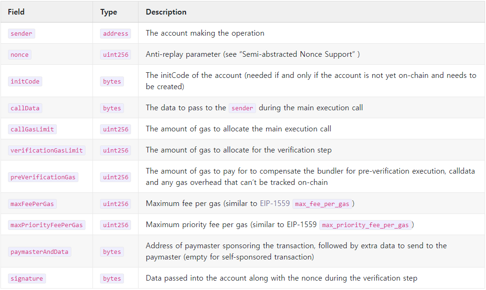
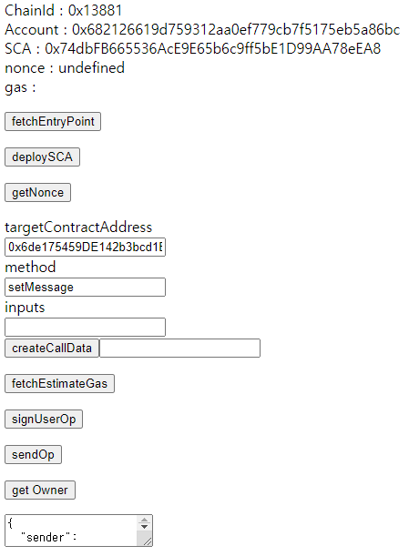
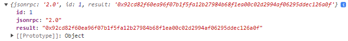

# ERC-4337 ([Alchemy](https://docs.alchemy.com/reference/bundler-api-endpoints) & [Infinitism](https://github.com/eth-infinitism) & Mumbai)

## Entry Point

"0x5FF137D4b0FDCD49DcA30c7CF57E578a026d2789"

## Simple Account Factory Address

"0x9406Cc6185a346906296840746125a0E44976454"

## .env
```
REACT_APP_ENTRYPOINT_ADDRESS = "0x5FF137D4b0FDCD49DcA30c7CF57E578a026d2789"
REACT_APP_ACCOUNT_FACTORY_ADDRESS = "0x9406cc6185a346906296840746125a0e44976454"
REACT_APP_USER_PRIVATE_KEY = "YOUR_EOA_PRIVATE_KEY"
```

## Deploy SCA 순서

1. SimpleAccountFactory에서 getAddress(address, salt)로 SCA 주소를 미리 확인

   - address는 EOA 지갑주소, salt는 시드값 (일반적으론 nonce or 0)
   - salt는 CREATE2에서 SCA Address를 생성하기 위해 사용됨
   - [CREATE2 참고자료](https://docs.openzeppelin.com/cli/2.8/deploying-with-create2)

2. initCode를 세팅한 UserOp를 작성 후 eth_estimateUserOperationGas 호출

   - `Given UserOperation optionally without gas limits and gas prices, return the needed gas limits.`
   - `The signature field is ignored by the wallet`
   - `Still, it might require putting a “semi-valid” signature (e.g. a signature in the right length)`

3. 2번에서 return 받은 gas 값을 userOp에 세팅

4. paymaster(대납자)가 없는 경우 EntryPoint의 depositTo() 함수를 통해 SCA에 balance를 deposit 해줘야함.

   메타마스크에서 SCA에 직접 보내도 됨(Metamask - Mumbai 테스트 완료)

5. userOp에 signature값 생성 후 세팅하여 eth_sendUserOperation 호출

### Example Data

#### initCode Sample
```
ops.sender : 0xf88Af9e8A2FE1453970891aE031Ad77FD6D2CB44
ops.initCode : 0x9406cc6185a346906296840746125a0e449764545fbfb9cf000000000000000000000000f9ce4d8b7800e6000a370c399ea4a63312926fb10000000000000000000000000000000000000000000000000000000000000000
```
#### initCode 구조

SCA Address : 0x9406cc6185a346906296840746125a0e44976454
Function Call Code : 5fbfb9cf000000000000000000000000

- function input
  - EOA Address : f9ce4d8b7800e6000a370c399ea4a63312926fb1
  - salt : 0000000000000000000000000000000000000000000000000000000000000000
    - uint256 Max -> Hex = 0xfff... (f가 256/4 = 64자리)

#### [example Tx](https://mumbai.polygonscan.com/tx/0xb6a87876937da48bb9e1d7e58145851057f05bd8b2af82aed158b02a3b8d1347)


## eth_sendUserOperation과 signature

### UserOperation 구조


Ref.https://eips.ethereum.org/EIPS/eip-4337

1. initCode
   - sender가 이미 deploy된 SCA인 경우 `0x`
2. callData
   - deploy만 하는 경우 `0x`
3. gas
4. signature
   - 안쓰는 경우에도 자릿수는 채워야 함
5. paymaster
   - 직접 지불인 경우 `0x`

### userOperation Sample
```
{
  "sender": "0x74dbFB665536AcE9E65b6c9ff5bE1D99AA78eEA8",
  "nonce": "0x4",
  "initCode": "0x",
  "callData": "0xb61d27f60000000000000000000000006de175459de142b3bcd1b63d3e07f21da48c7c14000000000000000000000000000000000000000000000000000000000000000000000000000000000000000000000000000000000000000000000000000000600000000000000000000000000000000000000000000000000000000000000064368b877200000000000000000000000000000000000000000000000000000000000000200000000000000000000000000000000000000000000000000000000000000007777271777277650000000000000000000000000000000000000000000000000000000000000000000000000000000000000000000000000000000000",
  "callGasLimit": "0x4000",
  "verificationGasLimit": "0xfdeb",
  "preVerificationGas": "0xab90",
  "maxFeePerGas": "0xaffffffff",
  "maxPriorityFeePerGas": "0xaffffffff",
  "signature": "0x69ac6dfb3bd65073069784fa5b027bec4dc23ae29f6b8e73ce09e83324dece1e201da0fd6a690ee9cfcbec3904522248ae498dc262801dd431a740c29f75f4d01c",
  "paymasterAndData": "0x"
}
```
- sender : SCA Address
- nonce : SCA의 nonce
   - Entrypoint.getNonce(`address` = SCA address, `key` = 보통 0)
- paymasterAndData : gas fee 대납자 address 및 data

### callData 구조

callData Sample
```
"0xb61d27f60000000000000000000000006de175459de142b3bcd1b63d3e07f21da48c7c14000000000000000000000000000000000000000000000000000000000000000000000000000000000000000000000000000000000000000000000000000000600000000000000000000000000000000000000000000000000000000000000064368b877200000000000000000000000000000000000000000000000000000000000000200000000000000000000000000000000000000000000000000000000000000007777271777277650000000000000000000000000000000000000000000000000000000000000000000000000000000000000000000000000000000000"
```
1. SCA의 execute 함수에 targetAddress, value, functionCallData 전달
2. target Contract에서 functionCallData를 분석하여 함수 호출

### eth_sendUserOperation 호출

1. calldata 작성
2. nonce값 세팅
3. eth_estimateUserOperationGas
4. return된 가스 추정 값 세팅
5. signature 세팅
6. userOperation, EntryPoint address를 Bundler에게 전송

## UserOperation과 Signature의 Validation (SimpleAccount)

1. SCA를 deploy한 EOA의 private key로 signature 생성
2. Bundler가 UserOperation을 EntryPoint의 handleOps()에 전달
   - _validatePrepayment() 호출
      - getUserOpHash()로 UserOpHash생성
      - _validateAccountPrepayment() 호출
         - SCA의 validateUserOp(userOp, userOpHash) 호출
            - _validateSignature(userOp, userOpHash) 호출
            - userOpHash로 hash값 생성
            - hash값과 userOp.signature로 public key 생성
            - SCA의 owner와 public key 일치여부 판단

## RPC methods

1. eth_sendUserOperation
2. eth_estimateUserOperationGas
3. eth_getUserOperationByHash
4. eth_getUserOperationReceipt
5. eth_supportedEntryPoints
6. eth_chainId

## Trouble Shooting

### deploy SCA (initCode 관련)
```
AA14 initCode must return sender
- 원인 : initcode 바탕으로 생성된 address와 userOp의 sender가 불일치함
- initcode 올바르게 작성 + sender에 SCA address 넣기
```

### eth_estimateUserOperationGas

### eth_supportedEntryPoints

### eth_sendUserOperation

### paymaster
```
Cannot read properties of undefined (reading 'paymaster')
- 원인 : provider와 signer 정보를 전달 하지 않아서 문제 발생
- 변경 전
   entryPoint = await new EntryPoint__factory().attach("0x5ff137d4b0fdcd49dca30c7cf57e578a026d2789")
- 변경 후
   entryPoint = await new EntryPoint__factory(signer).attach("0x5ff137d4b0fdcd49dca30c7cf57e578a026d2789")
```

### Bundler 관련
```
unable to parse transaction
- 원인 : UserOpMethodHandler.ts에서 EntryPoint.attach contract Address와 this.entry.address 대소문자 차이
- 변경 전
   const tx = await event.getTransaction()
   if (tx.to !== this.entryPoint.address) {
      throw new Error('unable to parse transaction')
   }
- 변경 후
   const tx = await event.getTransaction()
   if (tx.to?.toLowerCase() !== this.entryPoint.address.toLowerCase()) {
      throw new Error('unable to parse transaction')
   }
```
```
Account-Abstraction Bundler v.0.6.0. please use "/rpc"
- 원인 : bundler에게 전송 시 url 값 오류
- 변경 전
   http://localhost:3000/
- 변경 후
   http://localhost:3000/rpc
```

### hardhat & ethers.js & web3.js 등 개발 관련
<pre>
signing transactions is unsupported
- 원인 : ethers.getSigners() 로 생성한 객체는 signing이 불가능함.
- 변경 전
   accounts = await new ethers.getSigners()
   signer = accounts[0]
- 변경 후
   signer = await new ethers.Wallet("private key", provider)

<a href="https://github.com/ethers-io/ethers.js/issues/1869">참고 자료</a>
</pre>

### 테스트 및 확인 방법

1. .env파일 저장 및 변수 선언
2. metamask 로그인
3. fetchEntryPoint 함수 호출 확인 (개발자도구 콘솔)
4. deploySCA (SCA 최초 생성 시)
5. balance 관련 오류 발생 시 SCA 주소로 Matic 전송
6. deploySCA 재시도
7. inputs에 원하는 메세지 작성
8. getNonce -> createCallData -> fetchEstimateGas -> signUserOp
9. 아래 textarea영역에 userOp값 확인 후 sendOp
10. 콘솔창 userOpHash값 확인 및 [targetAddress Events 확인](https://mumbai.polygonscan.com/address/0x6de175459DE142b3bcd1B63d3E07F21Da48c7c14#events)


## 참고 자료
1. [EIP-4337](https://eips.ethereum.org/EIPS/eip-4337)
2. [Alchemy bundler Docs](https://docs.alchemy.com/reference/bundler-api-endpoints)
3. [eth-infinitism/bundler](https://github.com/eth-infinitism/bundler)
4. [eth-infinitism/account-abstraction](https://github.com/eth-infinitism/account-abstraction)
5. [Xangle ERC-4337](https://xangle.io/insight/research/64069b663b46fdc39f28d44c)
6. [Decipher ERC-4337](https://medium.com/decipher-media/ux%EA%B4%80%EC%A0%90%EC%97%90%EC%84%9C-%EC%82%B4%ED%8E%B4%EB%B3%B4%EB%8A%94-erc-4337-use-case-for-web3-game-7a4f81c46256)